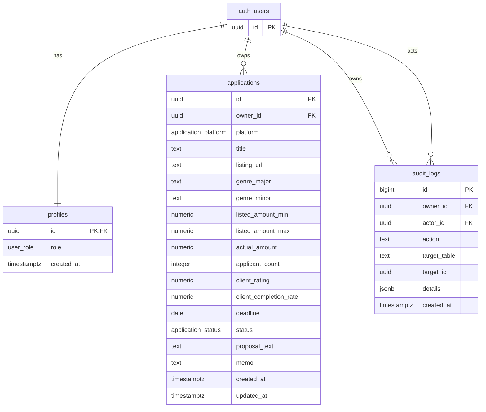

# ER図

Supabase Auth の `auth.users` をユーザー本体とし、公開スキーマにはプロフィール、案件、監査ログを保持します。

`user_role` は `user | admin`、`application_platform` は `crowdworks | lancers | coconala | other`、`application_status` は `considering | applied | replied | contracted | rejected | passed` です（**保存は英字キー・画面表示は日本語ラベルに変換する**）。全公開テーブルで RLS を有効化し、通常ユーザーは本人の行だけ参照・操作できます。
